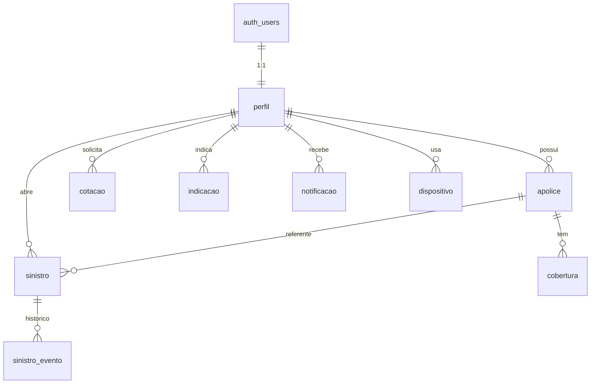

# App do Segurado — Especificação Técnica

## 1. Introdução

### 1.1 Objetivo

Este documento especifica as funcionalidades, a arquitetura, o modelo de dados, a API e os
requisitos de segurança e implantação do App do Segurado da BS Seguros. Ele complementa o
Documento de Requisitos emitido pela BS Labs (RF-01 a RF-08 e RNF-01 a RNF-03).

### 1.2 Escopo

- Protótipo funcional composto por aplicativo mobile, painel administrativo web e API REST.
- Base de dados própria, populada com dados fictícios por script de carga (seed). Não há
  integração com sistemas da BS Seguros.
- Os requisitos não funcionais de segurança (RNF-01, RNF-02 e RNF-03) e a conteinerização
  são implementados integralmente, independentemente da natureza fictícia dos dados.

### 1.3 Fora de escopo

- Integração com sistemas legados ou produtivos da BS Seguros.
- Pagamento de prêmio ou emissão de boleto.
- Envio de SMS. O único e-mail transacional é o de redefinição de senha.
- Regulação de sinistro. O sistema registra a abertura e o histórico de status.
- Precificação real de cotação. O sistema registra o pedido e a resposta manual.
- Autenticação por provedores externos (OAuth social).

### 1.4 Convenções

- **[EM ABERTO]** marca itens que dependem de decisão. A proposta vigente está descrita no
  próprio item; a lista consolidada está na seção 10.
- **Origem** de cada funcionalidade:
  - **RF-xx**: requisito do Documento de Requisitos.
  - **Base**: não consta do Documento de Requisitos, mas é condição para o funcionamento do
    sistema ou para completar um requisito.
  - **Extra**: agrega valor, mas o sistema funciona sem ela.
- **Prioridade**: **P1** compõe a primeira entrega (todo RF e toda função Base); **P2** é
  implementada após o P1; **P3** é opcional.
- **Componente**: `App` (mobile), `Admin` (painel web), `Web` (página pública) ou `API`.

## 2. Arquitetura

### 2.1 Stack

| Camada | Tecnologia |
|---|---|
| Linguagem | TypeScript, Node.js 22 |
| API e painel administrativo | Next.js (Route Handlers em `app/api/v1/**`) |
| Aplicativo mobile | React Native |
| Banco de dados | PostgreSQL gerenciado pelo Supabase |
| Autenticação | Supabase Auth (e-mail e senha); tokens em cookie HttpOnly emitido pela API |
| Armazenamento de arquivos | Supabase Storage, bucket privado `apolices` |
| Validação de entrada | Zod |
| Documentação da API | OpenAPI 3 gerado dos schemas Zod (`@asteasolutions/zod-to-openapi`), Swagger UI |
| Rate limit | rate-limiter-flexible |
| Tarefas agendadas | pg_cron |
| Notificação push | Expo Push Notifications **[EM ABERTO: depende do uso de Expo no app]** |
| Migrations e seed | Supabase CLI (`supabase/migrations/*.sql`, `supabase/seed.sql`) |
| Conteinerização | Docker |

### 2.2 Componentes

```text
App mobile ─┐
            ├── HTTPS/JSON ──> API Next.js ── service_role ──> Supabase
Admin web ──┘                  (contêiner)                     (PostgreSQL, Auth, Storage)
Web pública (indicação) ──────────┘
```

- Os clientes acessam exclusivamente a API. Nenhuma chave do Supabase é distribuída aos
  clientes.
- A API acessa o Supabase com a chave `service_role`, mantida apenas no servidor, e aplica o
  controle de acesso por usuário.
- Todas as tabelas têm RLS (Row Level Security) habilitado, sem policies para os papéis `anon`
  e `authenticated`. O acesso direto com a chave pública é negado por padrão.
- Autenticação por cookie, rate limit e CORS são implementados na camada da API.

### 2.3 Organização do código da API

| Diretório | Responsabilidade |
|---|---|
| `app/api/v1/**/route.ts` | Rotas; validação de entrada com Zod e delegação ao serviço |
| `lib/services` | Regras de negócio |
| `lib/supabase` | Cliente Supabase do lado do servidor |
| `lib/security` | Sessão por cookie, CORS e rate limit |

## 3. Funcionalidades

### 3.1 Conta e acesso

| Funcionalidade | Componente | Origem | Prioridade |
|---|---|---|---|
| Cadastro (nome, CPF, e-mail, telefone, data de nascimento, senha) | App | Base | P1 |
| Vínculo de apólices no cadastro (CPF e número de apólice) | App, API | Base | P1 |
| Login por e-mail e senha | App | Base | P1 |
| Sessão em cookie HttpOnly com renovação automática | App, API | RNF-01 | P1 |
| Logout | App | Base | P1 |
| Redefinição de senha por e-mail | App, Web | Base | P1 |
| Primeiro acesso: boas-vindas e solicitação de permissão de notificação | App | Base | P1 |
| Edição de dados cadastrais e troca de senha | App | Base | P1 |
| Aceite de termos de uso e política de privacidade | App | Base (LGPD) | P1 |
| Preferências de notificação por categoria | App | Extra | P2 |
| Exportação de dados e solicitação de exclusão de conta | App | Extra (LGPD) | P2 |
| Histórico de acessos e encerramento de todas as sessões | App | Extra | P3 |

### 3.2 Início (dashboard)

| Funcionalidade | Componente | Origem | Prioridade |
|---|---|---|---|
| Identificação do segurado | App | Base | P1 |
| Tempo de casa | App | RF-07 | P1 |
| Mensagem de aniversário | App | RF-08 | P1 |
| Resumo das apólices ativas | App | Base | P1 |
| Atalhos para assistência 24h, sinistro e cotação | App | Base | P1 |
| Contador de notificações não lidas | App | Base | P1 |
| Variante para usuário sem apólice vinculada, com foco em cotação | App | Base | P1 |

### 3.3 Apólices

| Funcionalidade | Componente | Origem | Prioridade |
|---|---|---|---|
| Listagem de apólices com status | App | RF-01 | P1 |
| Detalhe da apólice (número, produto, vigência, prêmio) | App | RF-01 | P1 |
| Visualização e download do PDF | App | RF-01 | P1 |
| Coberturas, limites e franquias | App | Extra | P2 |
| Carteirinha digital com QR code, disponível offline | App | Extra | P2 |
| Aviso de renovação 30 e 7 dias antes do fim da vigência | App, API | Extra | P2 |
| Consulta de parcelas (sem pagamento) | App | Extra | P3 |

### 3.4 Assistência 24h

| Funcionalidade | Componente | Origem | Prioridade |
|---|---|---|---|
| Contatos de assistência por produto | App | RF-02 | P1 |
| Acionamento por ligação ou WhatsApp | App | RF-02 | P1 |
| Envio de geolocalização no acionamento | App | Extra | P3 |
| Rede credenciada georreferenciada | App | Extra | P3 |

### 3.5 Sinistro

| Funcionalidade | Componente | Origem | Prioridade |
|---|---|---|---|
| Contatos de sinistro | App | RF-03 | P1 |
| Abertura de sinistro com geração de protocolo | App, API | RF-03 | P1 |
| Listagem de sinistros com status | App | Base | P1 |
| Histórico de status (linha do tempo) | App | Base | P1 |
| Notificação push na mudança de status | App, API | Base | P1 |
| Anexo de fotos | App | Extra | P2 |

O histórico e a notificação de status atendem à parte de "fluxos" do RF-03.

### 3.6 Cotação

| Funcionalidade | Componente | Origem | Prioridade |
|---|---|---|---|
| Formulário de cotação com campos por produto | App | RF-04 | P1 |
| Listagem de pedidos com status | App | Base | P1 |
| Resposta da cotação com notificação push | App, API | Base | P1 |
| Cotação de renovação pré-preenchida | App | Extra | P2 |

### 3.7 Indicação

| Funcionalidade | Componente | Origem | Prioridade |
|---|---|---|---|
| Link de indicação e compartilhamento | App | RF-05 | P1 |
| Página pública de destino do link, com formulário do indicado | Web | Base | P1 |
| Listagem de indicações com status | App | Base | P1 |
| Recompensa por indicação convertida | App | Extra | P3 |

A página pública é necessária porque o destinatário do link não possui o aplicativo.

### 3.8 Notificações

| Funcionalidade | Componente | Origem | Prioridade |
|---|---|---|---|
| Central de notificações in-app | App | RF-06 | P1 |
| Notificação push | App, API | RF-06 | P1 |
| Marcação de leitura | App | Base | P1 |
| Navegação para o registro de origem ao abrir a notificação | App | Base | P1 |
| Operação sem permissão de push (somente central in-app) | App | Base | P1 |

### 3.9 Ajuda

| Funcionalidade | Componente | Origem | Prioridade |
|---|---|---|---|
| Canais de contato da BS Seguros | App | Base | P1 |
| Perguntas frequentes | App | Extra | P2 |

### 3.10 Painel administrativo

O painel é a interface de operação dos fluxos que dependem de ação da seguradora: mudança de
status de sinistro, resposta de cotação e envio de campanhas (RF-06). Acesso restrito ao papel
`ADMIN`.

| Funcionalidade | Origem | Prioridade |
|---|---|---|
| Autenticação de administrador | Base | P1 |
| Consulta de segurados e apólices | Base | P1 |
| Gestão de sinistros e mudança de status | Base | P1 |
| Resposta de cotações | Base | P1 |
| Gestão de indicações | Base | P1 |
| Criação e envio de campanhas | RF-06 | P1 |
| Manutenção de contatos de assistência e sinistro | Base | P1 |
| Indicadores gerais | Extra | P2 |

### 3.11 Requisitos transversais dos clientes

- Estados de carregamento, lista vazia e erro em toda tela que consome a API.
- Operação sem conectividade: aviso ao usuário; carteirinha e contatos de assistência mantidos
  em cache local.
- Formulários com máscara (CPF, telefone, data), validação por campo e bloqueio de reenvio
  durante a requisição.
- Tratamento de `401`: chamada a `/auth/refresh` e repetição da requisição original; em caso de
  falha, redirecionamento ao login preservando os dados digitados.
- Tratamento de `429`: mensagem com o tempo de espera informado em `Retry-After`.
- Paginação em listas.
- Suporte ao ajuste de tamanho de fonte do sistema operacional.

## 4. Rastreabilidade

| Requisito | Implementação |
|---|---|
| RF-01 | Listagem de apólices e URL assinada para download do PDF no Storage |
| RF-02 | Contatos de assistência mantidos em `contato_assistencia` |
| RF-03 | Contatos de sinistro, abertura com protocolo e histórico em `sinistro_evento` |
| RF-04 | Registro de pedido em `cotacao` e resposta pelo painel administrativo |
| RF-05 | Código único por perfil, página pública e registro em `indicacao` |
| RF-06 | Notificações in-app em `notificacao`, push via Expo e campanhas pelo painel |
| RF-07 | Cálculo a partir de `perfil.cliente_desde` |
| RF-08 | Job diário pg_cron sobre `perfil.data_nascimento` |
| RNF-01 | Tokens em cookies `HttpOnly`, `Secure`, `SameSite=Strict` |
| RNF-02 | Limites por IP e por usuário com rate-limiter-flexible |
| RNF-03 | Lista de origens em `CORS_ALLOWED_ORIGINS` |

## 5. Modelo de dados

### 5.1 Diagrama entidade-relacionamento



### 5.2 Convenções

- Schema `public`, RLS habilitado em todas as tabelas.
- Chaves primárias `uuid`; datas com hora em `timestamptz`.
- Credenciais em `auth.users`, sob gestão do Supabase Auth. Nenhuma tabela da aplicação
  armazena senha.

### 5.3 Tabelas

**perfil** — dados do usuário; segurados e administradores são diferenciados por `papel`.

| Coluna | Tipo | Restrição |
|---|---|---|
| id | uuid | PK; FK `auth.users.id` |
| cpf | varchar(11) | UNIQUE; somente dígitos; dígito verificador validado |
| nome | varchar(120) | NOT NULL |
| telefone | varchar(20) | |
| data_nascimento | date | NOT NULL |
| cliente_desde | date | NOT NULL; definido pelo sistema |
| papel | varchar(20) | `SEGURADO` \| `ADMIN`; cadastro público cria apenas `SEGURADO` |
| codigo_indicacao | varchar(12) | UNIQUE; gerado no cadastro |
| aceita_marketing | boolean | DEFAULT `true` |
| termos_aceitos_em | timestamptz | NOT NULL |
| criado_em | timestamptz | DEFAULT `now()` |

**apolice**

| Coluna | Tipo | Restrição |
|---|---|---|
| id | uuid | PK |
| cpf_titular | varchar(11) | NOT NULL |
| perfil_id | uuid | FK `perfil`; preenchido no vínculo |
| numero | varchar(30) | UNIQUE |
| produto | varchar(30) | `AUTO` \| `RESIDENCIAL` \| `VIDA` \| `EMPRESARIAL` |
| status | varchar(20) | `ATIVA` \| `VENCIDA` \| `CANCELADA` |
| inicio_vigencia | date | NOT NULL |
| fim_vigencia | date | CHECK `fim_vigencia > inicio_vigencia` |
| premio | numeric(12,2) | |
| pdf_caminho | varchar(255) | caminho no bucket `apolices` |

**cobertura** (P2)

| Coluna | Tipo | Restrição |
|---|---|---|
| id | uuid | PK |
| apolice_id | uuid | FK `apolice` |
| nome | varchar(80) | NOT NULL |
| descricao | text | |
| limite | numeric(12,2) | |
| franquia | numeric(12,2) | |

**contato_assistencia**

| Coluna | Tipo | Restrição |
|---|---|---|
| id | uuid | PK |
| tipo | varchar(20) | `ASSISTENCIA_24H` \| `SINISTRO` |
| produto | varchar(30) | NULL aplica-se a todos os produtos |
| rotulo | varchar(80) | NOT NULL |
| telefone | varchar(20) | |
| whatsapp | varchar(20) | |
| ativo | boolean | DEFAULT `true` |

**sinistro**

| Coluna | Tipo | Restrição |
|---|---|---|
| id | uuid | PK |
| perfil_id | uuid | FK `perfil` |
| apolice_id | uuid | FK `apolice`; a apólice deve pertencer ao mesmo perfil |
| protocolo | varchar(20) | UNIQUE; gerado pela API |
| tipo | varchar(30) | `COLISAO` \| `ROUBO` \| `INCENDIO` \| `DANO_ELETRICO` \| ... |
| data_ocorrencia | timestamptz | CHECK não futura |
| local | varchar(200) | |
| descricao | text | |
| status | varchar(20) | `ABERTO` \| `EM_ANALISE` \| `CONCLUIDO` |
| criado_em, atualizado_em | timestamptz | |

**sinistro_evento**

| Coluna | Tipo | Restrição |
|---|---|---|
| id | uuid | PK |
| sinistro_id | uuid | FK `sinistro` |
| status | varchar(20) | status resultante |
| comentario | text | mensagem ao segurado |
| autor_id | uuid | FK `perfil`; NULL quando gerado pelo sistema |
| criado_em | timestamptz | |

**cotacao**

| Coluna | Tipo | Restrição |
|---|---|---|
| id | uuid | PK |
| perfil_id | uuid | FK `perfil` |
| produto | varchar(30) | domínio de `apolice.produto` |
| dados | jsonb | campos do formulário, variáveis por produto |
| status | varchar(20) | `RECEBIDA` \| `EM_ANALISE` \| `RESPONDIDA` |
| resposta | text | |
| valor_estimado | numeric(12,2) | |
| respondida_em | timestamptz | |
| criado_em | timestamptz | |

**indicacao**

| Coluna | Tipo | Restrição |
|---|---|---|
| id | uuid | PK |
| indicador_id | uuid | FK `perfil` |
| nome | varchar(120) | NOT NULL |
| telefone | varchar(20) | NOT NULL |
| email | varchar(160) | |
| status | varchar(20) | `NOVA` \| `CONTATADA` \| `CONVERTIDA` |
| criado_em | timestamptz | |

**notificacao**

| Coluna | Tipo | Restrição |
|---|---|---|
| id | uuid | PK |
| perfil_id | uuid | FK `perfil` |
| tipo | varchar(20) | `MARKETING` \| `ANIVERSARIO` \| `SISTEMA` |
| titulo | varchar(120) | NOT NULL |
| mensagem | text | NOT NULL |
| destino_tipo | varchar(20) | `SINISTRO` \| `COTACAO` \| `APOLICE` |
| destino_id | uuid | registro de destino |
| lida_em | timestamptz | |
| push_enviado_em | timestamptz | |
| criado_em | timestamptz | |

**dispositivo**

| Coluna | Tipo | Restrição |
|---|---|---|
| id | uuid | PK |
| perfil_id | uuid | FK `perfil` |
| push_token | varchar(255) | UNIQUE |
| plataforma | varchar(10) | `ANDROID` \| `IOS` |
| atualizado_em | timestamptz | |

### 5.4 Regras de negócio no banco e na API

**Vínculo de apólices no cadastro.** As apólices são carregadas pelo seed e identificadas por
`cpf_titular`. O vínculo exige o CPF e o número de uma apólice do mesmo titular; o CPF isolado
não é considerado prova de titularidade. Havendo vínculo, `cliente_desde` recebe o menor
`inicio_vigencia` entre as apólices vinculadas; sem vínculo, recebe a data do cadastro.
**[EM ABERTO]**

Limitação: como `cpf` é único, um cadastro com CPF de terceiro, sem número de apólice, impede
o cadastro do titular. No protótipo, a conta é removida pelo administrador; em produção, seria
necessária validação documental do CPF.

**Histórico de sinistro.** A abertura grava o evento `ABERTO`. Cada mudança de status grava um
evento em `sinistro_evento` e uma `notificacao` com `destino_tipo = SINISTRO`.

**Aniversário (RF-08).** Job pg_cron diário com agendamento `0 11 * * *` (08:00 em
America/Sao_Paulo, UTC−3). Insere uma notificação `ANIVERSARIO` para cada perfil cuja data de
nascimento coincide com a data corrente no fuso de São Paulo. Nascidos em 29/02 são
contemplados em 28/02 nos anos não bissextos. O envio do push é feito pela rota
`/internal/push/pendentes`.

### 5.5 Carga de dados (seed)

Executada apenas no ambiente de desenvolvimento (`supabase/seed.sql`):

- 5 segurados com credenciais de teste documentadas no README do repositório e 1 administrador;
- 1 a 3 apólices por segurado, com PDFs de exemplo no bucket `apolices`;
- apólices de CPFs sem conta, para validação do fluxo de vínculo no cadastro;
- contatos de assistência e de sinistro;
- sinistros com histórico, cotações, indicações e notificações;
- ao menos um perfil com aniversário na data de demonstração.

## 6. API

### 6.1 Convenções

- Base: `/api/v1`. Formato JSON.
- Autenticação obrigatória, exceto nas rotas marcadas como públicas.
- Isolamento por usuário: acesso a registro de outro perfil retorna `404`.
- Listas aceitam `?pagina=1&limite=20` (máximo 50).

### 6.2 Infraestrutura

| Método | Rota | Descrição |
|---|---|---|
| GET | `/health` | Pública. Estado da API e da conexão com o banco; usada no healthcheck do contêiner |

### 6.3 Autenticação e conta

| Método | Rota | Descrição |
|---|---|---|
| POST | `/auth/cadastro` | Pública. Cria conta e perfil, vincula apólices e inicia a sessão |
| POST | `/auth/login` | Pública. `{email, senha}`; inicia a sessão |
| POST | `/auth/refresh` | Pública. Renova a sessão a partir do cookie de refresh |
| POST | `/auth/logout` | Encerra a sessão e remove os cookies |
| POST | `/auth/esqueci-senha` | Pública. Dispara o e-mail de redefinição |
| GET | `/me` | Perfil do usuário autenticado |
| PATCH | `/me` | Atualiza `telefone` e `aceita_marketing` |

Validações do cadastro: dígito verificador do CPF; unicidade de CPF e e-mail; senha com no
mínimo 8 caracteres; idade mínima de 18 anos; aceite dos termos. Conflito de CPF ou e-mail
retorna mensagem genérica, sem indicar qual dado já existe.

### 6.4 Dashboard

| Método | Rota | Descrição |
|---|---|---|
| GET | `/dashboard` | Nome, tempo de casa, indicador de aniversário, apólices ativas e contagem de notificações não lidas |

### 6.5 Apólices

| Método | Rota | Descrição |
|---|---|---|
| GET | `/apolices` | Apólices do usuário |
| GET | `/apolices/{id}` | Detalhe com coberturas |
| GET | `/apolices/{id}/pdf` | URL assinada do Storage, validade de 60 s |

### 6.6 Assistência e sinistro

| Método | Rota | Descrição |
|---|---|---|
| GET | `/contatos?tipo={tipo}` | Contatos ativos do tipo `ASSISTENCIA_24H` ou `SINISTRO`, filtrados pelos produtos do usuário |
| POST | `/sinistros` | Abertura; retorna o protocolo |
| GET | `/sinistros` | Sinistros do usuário |
| GET | `/sinistros/{id}` | Detalhe com histórico de eventos |

### 6.7 Cotação

| Método | Rota | Descrição |
|---|---|---|
| POST | `/cotacoes` | Registro de pedido |
| GET | `/cotacoes` | Pedidos do usuário, com resposta quando houver |

### 6.8 Indicação

| Método | Rota | Descrição |
|---|---|---|
| GET | `/indicacoes/link` | Link de indicação do usuário |
| GET | `/indicacoes` | Indicações feitas pelo usuário |
| POST | `/public/indicacoes/{codigo}` | Pública. Registro do indicado a partir da página pública |

### 6.9 Notificações

| Método | Rota | Descrição |
|---|---|---|
| GET | `/notificacoes` | Notificações do usuário, ordem decrescente |
| PATCH | `/notificacoes/{id}/lida` | Marca como lida |
| POST | `/dispositivos` | Registra ou atualiza token de push |
| DELETE | `/dispositivos/{token}` | Remove token (logout) |
| POST | `/internal/push/pendentes` | Autenticada por `INTERNAL_API_KEY`. Envia push das notificações com `push_enviado_em` nulo |

### 6.10 Administração

Todas as rotas exigem o papel `ADMIN`; demais papéis recebem `403`.

| Método | Rota | Descrição |
|---|---|---|
| GET | `/admin/segurados?busca=` | Busca por nome, CPF ou e-mail |
| GET | `/admin/segurados/{id}` | Perfil e apólices |
| GET | `/admin/sinistros?status=` | Sinistros com filtro |
| PATCH | `/admin/sinistros/{id}/status` | Altera status, grava evento e notifica |
| GET | `/admin/cotacoes?status=` | Cotações com filtro |
| PATCH | `/admin/cotacoes/{id}/resposta` | Registra resposta e notifica |
| GET | `/admin/indicacoes?status=` | Indicações com filtro |
| PATCH | `/admin/indicacoes/{id}/status` | Altera status |
| GET, POST, PATCH | `/admin/contatos` | Manutenção de contatos |
| POST | `/admin/campanhas` | Envio de campanha para todos ou por produto; respeita `aceita_marketing` |
| GET | `/admin/resumo` | Indicadores gerais (P2) |

### 6.11 Documentação interativa

| Rota | Conteúdo |
|---|---|
| `/api/docs` | Swagger UI |
| `/api/openapi.json` | Especificação OpenAPI 3 |

A especificação é gerada a partir dos schemas Zod usados na validação das rotas. Em produção,
`/api/docs` é desabilitado ou restrito ao papel `ADMIN`.

### 6.12 Erros

```json
{ "status": 400, "erro": "VALIDACAO", "mensagem": "cpf inválido", "campos": { "cpf": "dígito verificador inválido" } }
```

| Código | Condição |
|---|---|
| 400 | Entrada inválida |
| 401 | Sessão ausente ou expirada |
| 403 | Papel sem permissão |
| 404 | Registro inexistente ou de outro usuário |
| 429 | Limite de requisições excedido; cabeçalho `Retry-After` |

## 7. Segurança

### 7.1 Autenticação e sessão (RNF-01)

- O Supabase Auth emite access token (JWT, validade de 1 h) e refresh token. A API não
  retorna os tokens no corpo da resposta; ambos são gravados em cookies:

| Cookie | Path | Atributos |
|---|---|---|
| `access_token` | `/api` | `HttpOnly`, `Secure`, `SameSite=Strict` |
| `refresh_token` | `/api/v1/auth/refresh` | `HttpOnly`, `Secure`, `SameSite=Strict` |

- O atributo `HttpOnly` impede a leitura dos tokens por script, mitigando exfiltração via XSS.
- A API valida o JWT a cada requisição (segredo do projeto ou JWKS, conforme a configuração
  de chaves do Supabase).
- `Secure` é controlado por `COOKIE_SECURE`: `false` apenas em desenvolvimento local sobre HTTP.
- Hash de senha (bcrypt) sob responsabilidade do Supabase Auth.
- Cliente React Native: o `fetch` utiliza o cookie store nativo da plataforma; as requisições
  devem usar `credentials: 'include'`.

### 7.2 Rate limit (RNF-02)

| Escopo | Limite |
|---|---|
| `/auth/login` | 5 req/min por IP |
| `/auth/cadastro`, `/auth/esqueci-senha` | 3 req/min por IP |
| `/public/**` | 10 req/min por IP |
| Demais rotas | 100 req/min por usuário |

Excedido o limite, a API retorna `429` com `Retry-After`. Os contadores ficam em memória,
válidos para instância única; com múltiplas instâncias, migram para armazenamento em
PostgreSQL (suportado pela mesma biblioteca).

### 7.3 CORS (RNF-03)

- Origens permitidas definidas em `CORS_ALLOWED_ORIGINS`; curinga `*` não é aceito.
- `Access-Control-Allow-Credentials: true`.
- A política é aplicada por navegadores (painel administrativo e página pública); clientes
  nativos não são sujeitos a CORS.

### 7.4 Gestão de segredos

- `SUPABASE_SERVICE_ROLE_KEY` concede acesso irrestrito ao banco e existe apenas no ambiente
  da API.
- O repositório contém somente `.env.example`, sem valores.

## 8. Implantação

### 8.1 Contêineres

| Componente | Desenvolvimento | Produção |
|---|---|---|
| API | Imagem Docker multi-stage: build Next.js `output: 'standalone'`; runtime `node:22-alpine`, usuário não root, porta 3000 | Mesma imagem, em provedor com suporte a contêiner **[EM ABERTO]** |
| Banco, Auth, Storage | `supabase start` (Supabase CLI sobre Docker), com migrations e seed | Supabase Cloud **[EM ABERTO]** |

Inicialização em desenvolvimento: `supabase start` seguido de `docker compose up --build`.

### 8.2 Variáveis de ambiente

| Variável | Descrição |
|---|---|
| `SUPABASE_URL` | URL do projeto Supabase |
| `SUPABASE_SERVICE_ROLE_KEY` | Chave de servidor |
| `SUPABASE_JWT_SECRET` | Segredo de validação do JWT; não utilizado quando o projeto usa chaves assimétricas (JWKS) |
| `CORS_ALLOWED_ORIGINS` | Origens autorizadas, separadas por vírgula |
| `COOKIE_SECURE` | `false` apenas em desenvolvimento local |
| `INTERNAL_API_KEY` | Autenticação de `/internal/push/pendentes` |

### 8.3 Restrições operacionais

| Restrição | Mitigação |
|---|---|
| Projetos do plano gratuito do Supabase são pausados após 7 dias sem atividade | Acesso periódico ao projeto antes de demonstrações |
| O SMTP padrão do Supabase tem cota baixa de envio por hora | SMTP próprio (ex.: Resend) ou confirmação de e-mail desabilitada no protótipo |
| Entrega de push depende do dispositivo e da rede | Central de notificações in-app como canal redundante |
| Telas sem dados comprometem a validação funcional | Seed completo, incluindo perfil com aniversário na data de demonstração |

## 9. Divergências em relação ao Documento de Requisitos

| Item do Documento de Requisitos | Implementação adotada |
|---|---|
| API em Java com Spring Boot | API em Node.js com Next.js |
| PostgreSQL | PostgreSQL gerenciado pelo Supabase (aderente) |
| Backend e banco conteinerizados em desenvolvimento e produção | Aderente em desenvolvimento; em produção, o banco é serviço gerenciado. Alternativa aderente: Supabase self-hosted via Docker Compose |

## 10. Itens em aberto

| # | Item | Proposta |
|---|---|---|
| 1 | Aceite, pela BS Labs, da troca de Spring Boot por Next.js | Formalizar antes do início da implementação |
| 2 | Conteinerização do banco em produção | Supabase Cloud; self-hosted se exigido |
| 3 | Regra de vínculo entre cadastro e apólices | CPF e número de apólice do titular |
| 4 | Identificador de login | E-mail; CPF mantido no perfil |
| 5 | Abrangência do RF-03 | Contatos, abertura com protocolo e histórico; sem anexos no P1 |
| 6 | Uso de Expo no aplicativo | Expo Push para Android e iOS |
| 7 | Hospedagem da API | Provedor com suporte a contêiner (ex.: Render, Railway) |
| 8 | Recompensa por indicação | Selo no aplicativo, sem valor monetário |
| 9 | Funcionalidades disponíveis ao usuário sem apólice | Cotação, indicação, assistência e ajuda; sem sinistro |
| 10 | Confirmação de e-mail no cadastro | Desabilitada no protótipo |
| 11 | Escopo P2 a ser assumido | Carteirinha, coberturas e aviso de renovação |
